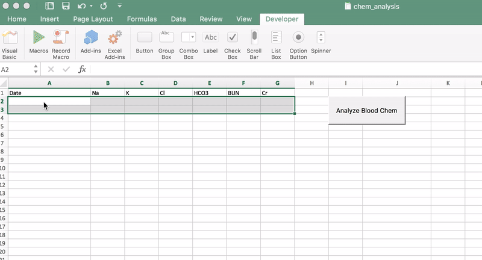

# For short mornings with a mildly functioning brain
------------

Download the spreadsheet and copy/paste to do some simple analysis of lab values in the morning.
You will need to enable macros to analyze the values.

More functionality to come. Still a work in progress, so download, modify and
contribute! If you have questions with how to use git, just let me know.

Suggestions about what to include next welcome. I was planning on doing the blood gas stuff with Winter's. But also could add analysis of free water deficits, drip rates for sodium rebalance etc.

While these calculators exist elsewhere, the point of this is to simplify the workflow to copy/paste (en block) and then click a button, instead of navigating all over the place and punching values in. Suggestions on this welcome as well.

## Example usage
Copy and paste values into the spreadsheet. If your values are in a different column,
just rename the columns at the top of the spreadsheet. However the names still need to be
spelled the same, i.e. `Na`, `Cl`, `HCO3` etc.

### Boring stuff:

#### License:

MIT License

Copyright (c) 2017 Matthew Antalek Jr.

Permission is hereby granted, free of charge, to any person obtaining a copy
of this software and associated documentation files (the "Software"), to deal
in the Software without restriction, including without limitation the rights
to use, copy, modify, merge, publish, distribute, sublicense, and/or sell
copies of the Software, and to permit persons to whom the Software is
furnished to do so, subject to the following conditions:

The above copyright notice and this permission notice shall be included in all
copies or substantial portions of the Software.

THE SOFTWARE IS PROVIDED "AS IS", WITHOUT WARRANTY OF ANY KIND, EXPRESS OR
IMPLIED, INCLUDING BUT NOT LIMITED TO THE WARRANTIES OF MERCHANTABILITY,
FITNESS FOR A PARTICULAR PURPOSE AND NONINFRINGEMENT. IN NO EVENT SHALL THE
AUTHORS OR COPYRIGHT HOLDERS BE LIABLE FOR ANY CLAIM, DAMAGES OR OTHER
LIABILITY, WHETHER IN AN ACTION OF CONTRACT, TORT OR OTHERWISE, ARISING FROM,
OUT OF OR IN CONNECTION WITH THE SOFTWARE OR THE USE OR OTHER DEALINGS IN THE
SOFTWARE.
